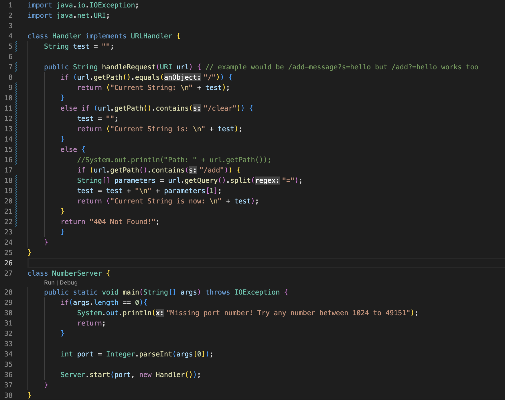
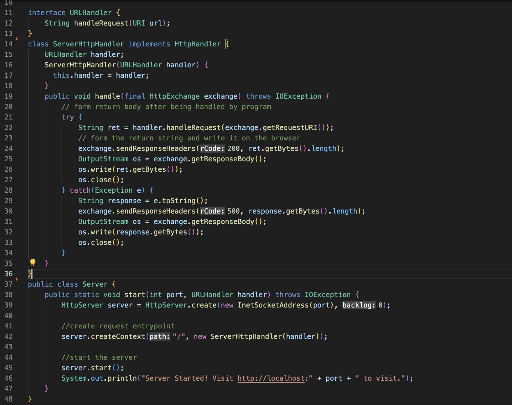
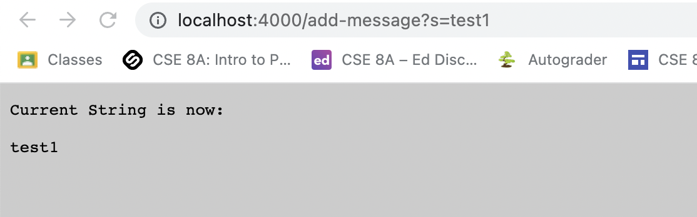
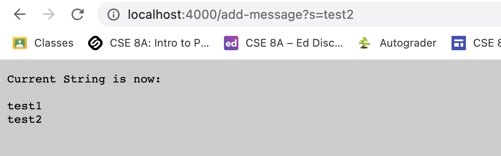
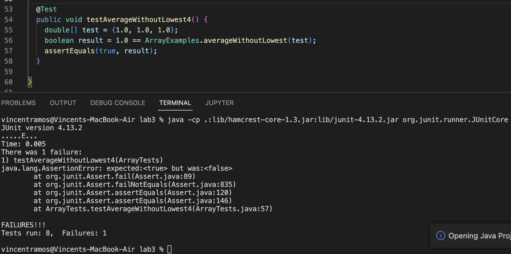
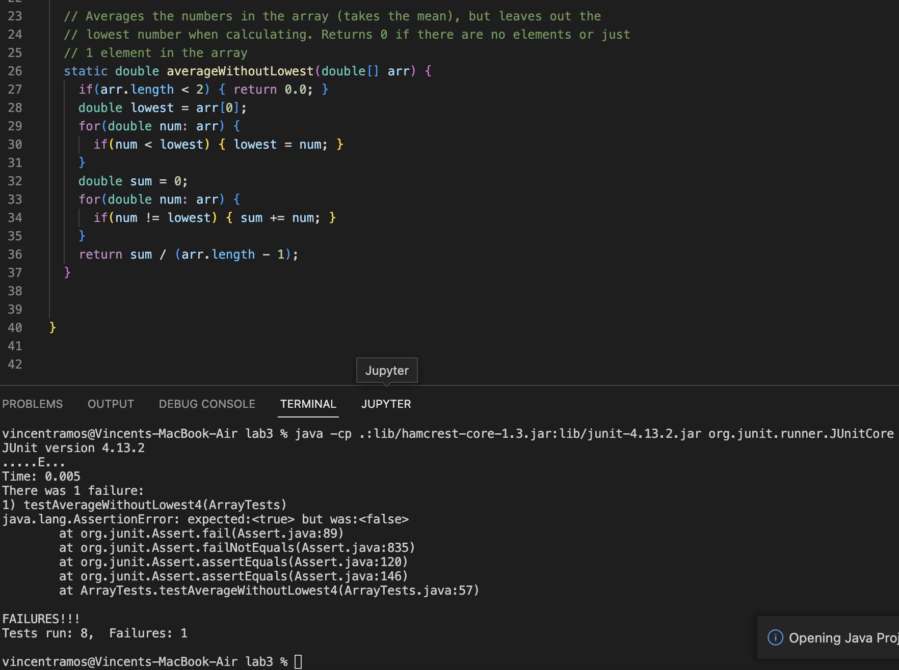
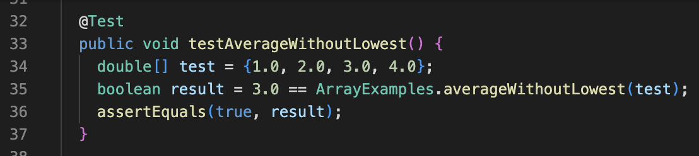
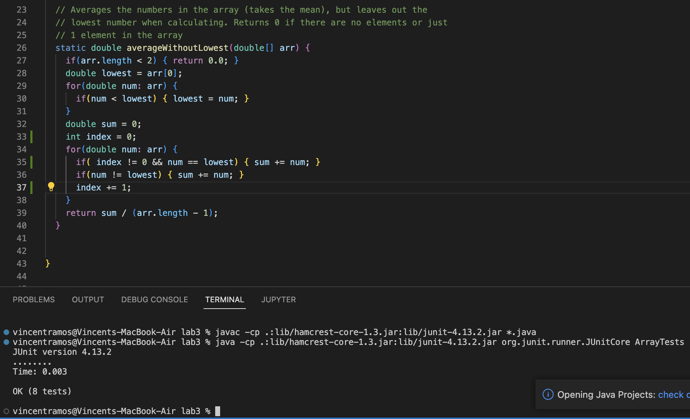

# Lab Report 2

For this lab report, I had changed the code that we were previously given to run a server in order for it to keep track of strings instead.

The image above is the previously used NumberServers.java file, but with drastic changes to the Handler class.


This is a screenshot of the Server.java code that was used. This code was untouched. There are a few imports not shown above the screenshot of the code as they weren't able to fit in the image.


This is the first screenshot of using "/add-message" in the URL. No methods from Server.java are used as those methods are involved with the actual creation of the server. The ```handleRequest``` method is being used here. The method splits the URL where there is an "=" if the URL contains "/add". It then takes the string that comes after the "=" and adds it onto the currently empty string which is returned. 


This is the second screenshot of using "/add-message" in the URL. No methods are also used from the Server.java file here. The same exact ```handleRequest``` method is being used here. The only difference is that instead of an empty string being added to, the string is no longer empty and still contains the text that was previously returned. Therefore, it returns the previously returned string and the new string added on through "/add-message"

Part 2


The screenshot above is of a JUnit test written for the method ```averageWithoutLowest```. It is a failure inducing input, because the code ignores the lowest number, however, every number in this test is equal to each other. The symptom of using the input ```double[] test = {1.0, 1.0, 1.0}``` can be seen at the bottom of the screenshot, through the 1 failed test. 


The screenshot above is of the ```averageWithoutLowest``` method. It can be seen that it simply does nothing if the number is equal to the lowest, which is where our problem originates.


The screenshot above is of a JUnite test written for the method ```averageWithoutLowest```. It is an input that doesn't induce a failure. Once again, the symptom of only the previously mentioned test failing can be seen at the bottom of the screenshot. The test using ```double[] test = {1.0, 2.0, 3.0, 4.0}``` is part of the 8 tests which were run, but didn't fail. 


The screenshot above is of the code after it was fixed.

```static double averageWithoutLowest(double[] arr) {

      if(arr.length < 2) { return 0.0; }
      
      double lowest = arr[0];
      
      for(double num: arr) {
      
      if(num < lowest) { lowest = num; }
   
   }
    
    double sum = 0;
    
    int index = 0;
    
    for(double num: arr) {
      
      if( index != 0 && num == lowest) { sum += num; }
      
      if(num != lowest) { sum += num; }
      
      index += 1;
    
    }
    
    return sum / (arr.length - 1);
  
  }```
